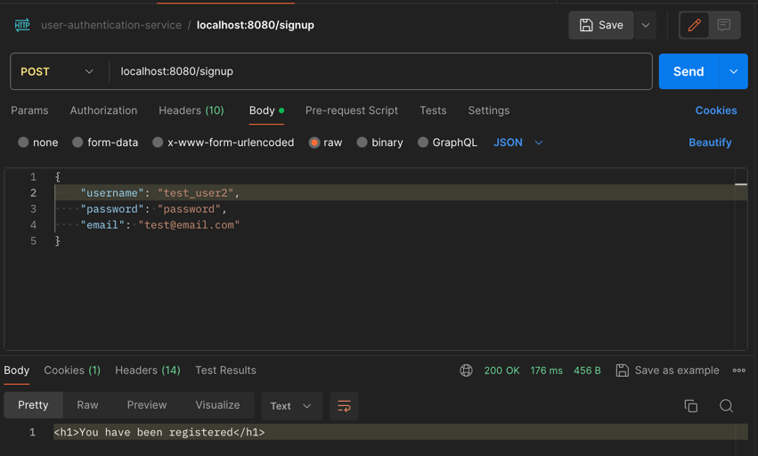
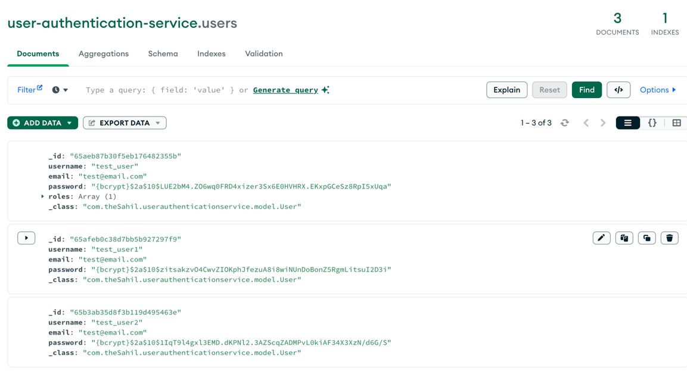
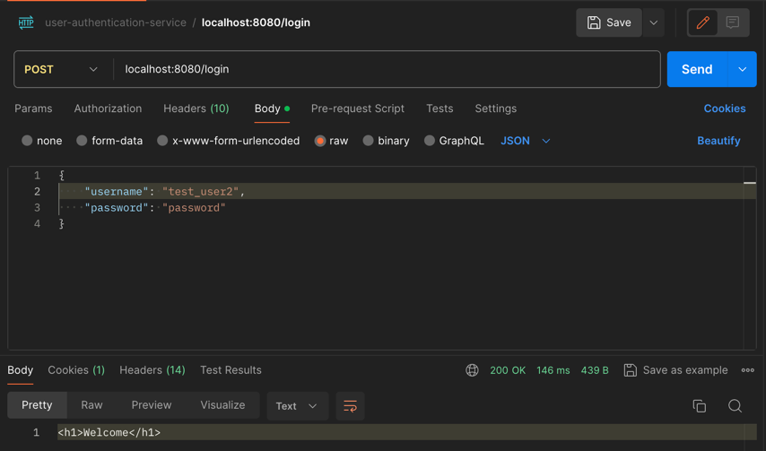

# user-authentication-service

The user-authentication-service project offers a straightforward demonstration of user authentication processes, leveraging a stack comprising Spring Security, Spring Data JPA, and MongoDB. Designed to illustrate fundamental authentication flows, this project provides a hands-on exploration of user signup and login functionalities.

### Key Components:

**Spring Security**: Ensures robust security mechanisms for user authentication and authorization within the application.

**Spring Data JPA**: Facilitates seamless interaction with the underlying MongoDB database, streamlining data access operations.

**MongoDB**: Serves as the persistent storage solution for user authentication details, providing flexibility and scalability.

## Overview
This service comprises two primary endpoints, each catering to distinct aspects of the authentication process.
### /signup: 
Allows users to register by providing their desired username and password. Upon successful signup, user credentials are securely stored in MongoDB for future authentication purposes.
    

_mongodbDB snapshot with sample data_
    

### /login: 
Provides users with the ability to authenticate themselves using their registered credentials. Upon successful login, users gain access to authorized resources within the application.
    

**How to set up:**
1. Clone the repo.
2. run "mvn clean install".
3. run "docker-compose up".
4. application is ready to run & test in postman.